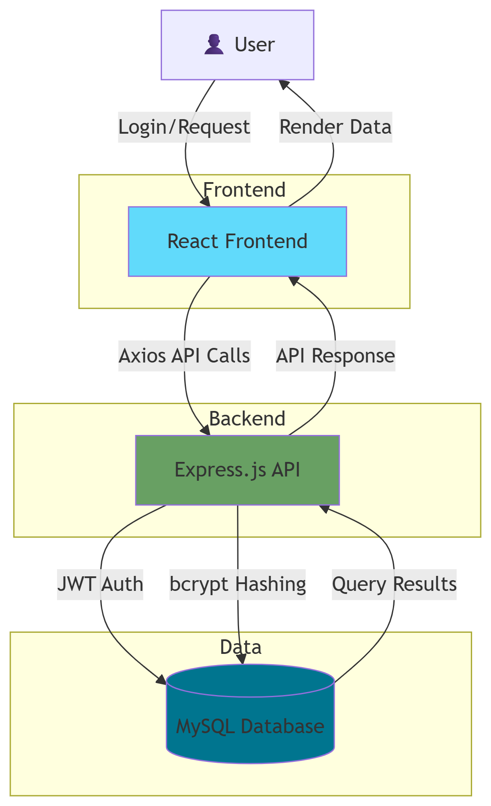
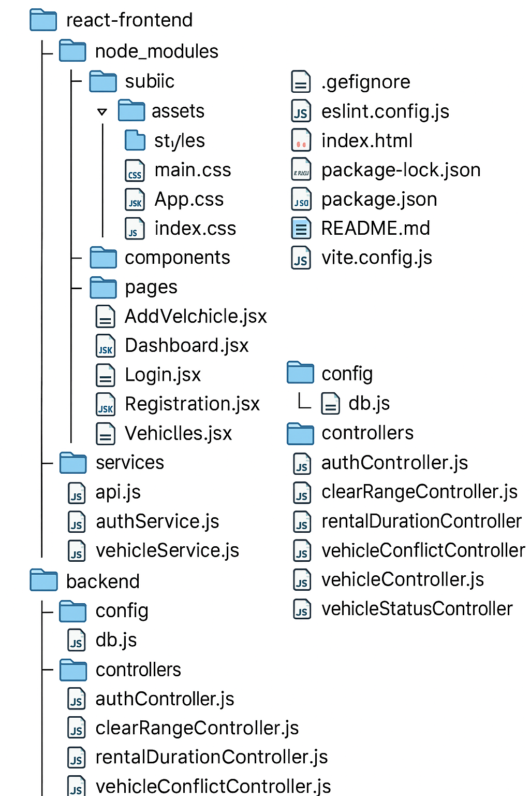

# 🚗 Smart Fleet

Smart Fleet is a comprehensive fleet and rental management application built as part of Holberton School's Web Stack Portfolio Project. It empowers businesses to track vehicle availability, manage reservations, and streamline operations in real-time.

<div align="center">
  


</div>

## 📌 Table of Contents

- [Overview](#-overview)
- [Features](#-features)
- [Tech Stack](#-tech-stack)
- [Architecture](#-architecture)
- [Installation](#-installation)
- [Usage](#-usage)
- [Project Structure](#-project-structure)
- [Key Learnings](#-key-learnings)
- [Roadmap](#-roadmap)
- [Author](#-author)

## 🔍 Overview

Smart Fleet is designed for small to medium car rental businesses seeking an intuitive solution to simplify their vehicle management operations. The application provides a real-time dashboard that allows users to:

- Monitor vehicle availability with visual status indicators
- Create and manage rental periods with an intuitive interface
- Track vehicle status changes through a responsive dashboard
- Manage user accounts with role-based access control
- Secure data with user-specific databases and JWT authentication

## ✨ Features

- **User Authentication**
  - Secure registration and login with JWT
  - Password encryption with bcrypt
  - User-specific database creation upon registration

- **Vehicle Management**
  - Real-time vehicle status tracking (Available/Rented)
  - Interactive status updates with date validation
  - Comprehensive vehicle information display

- **Rental Operations**
  - Date-based reservation system
  - Conflict prevention logic
  - Rental history tracking

- **Dashboard Interface**
  - Dynamic, responsive UI
  - Role-specific views
  - Real-time data visualization

## 🛠️ Tech Stack

### Frontend
- **React.js** - Component-based UI architecture
- **Axios** - Promise-based HTTP client
- **CSS Modules** - Styling and responsiveness
- **React Router** - Client-side routing

### Backend
- **Node.js** - JavaScript runtime
- **Express.js** - Web application framework
- **JWT** - Secure authentication
- **Bcrypt** - Password hashing
- **CORS / Custom Middleware** - Request handling and security

### Database
- **MySQL** - Relational database with user-specific instances

## 🏗️ Architecture
Frontend (React) ⟷ Axios (REST API) ⟷ Backend (Express + Node) ⟷ MySQL (User DB)

- **Authentication Flow:** JWT-based with refresh token mechanism
- **Data Security:** Passwords hashed via bcrypt, HTTPS in production
- **API Design:** RESTful endpoints with middleware protection



## 🚀 Installation

### Prerequisites
- Node.js (v14+)
- MySQL (v8+)
- npm or yarn

### Setup Steps

1. **Clone the repository**
   ```bash
   git clone https://github.com/NACIMSAAFI/Smart-fleet-management
   cd smart-fleet

Backend Setup
bashcd backend
npm install

# Configure environment variables
cp .env.example .env
# Edit .env with your database credentials and JWT secret

Frontend Setup
bashcd ../frontend
npm install

Environment Configuration
Create a .env file in the backend directory:
PORT=5000
DB_HOST=localhost
DB_USER=root
DB_PASSWORD=yourpassword
JWT_SECRET=your_secure_jwt_secret

Database Setup
bash# Run the database initialization script from backend directory
npm run db:setup

Start the Application
bash# Start backend (from backend directory)
npm run dev

# Start frontend (from frontend directory)
npm start


## 💻 Usage

# Register a new account

The system automatically creates a dedicated database for your account


Log in to access the dashboard

View all vehicles and their current status


# Manage vehicles

Add new vehicles to the fleet
Update vehicle details and status


# Handle rentals

Create new rental entries
Update status through the date selection interface
View rental history and upcoming returns


# User management (Admin only)

Create and manage staff accounts
Assign appropriate permissions


## 📁 Project Structure



# 📚 Key Learnings
This project provided valuable experience in:

Dynamic Database Creation - Implementing per-user database provisioning
Authentication Systems - Building secure JWT-based auth flows
React Component Architecture - Structuring a maintainable React application
Date Logic - Managing complex date-based interactions and validations
Full-Stack Integration - Coordinating frontend and backend development

## 🔮 Roadmap
Future enhancements planned for Smart Fleet:

Role-Based Access Control - Advanced permissions for Admin vs Employee roles
Notification System - Automated alerts for upcoming returns and maintenance
Performance Optimization - Query improvements and caching strategies
Mobile Application - Cross-platform mobile version using React Native
Analytics Dashboard - Business intelligence features with data visualization
Cloud Deployment - Production deployment on Render, Vercel, or Railway

## 👨‍💻 Author
Nacim Saafi
[GitHub](https://github.com/nacimsaafi) • [LinkedIn](https://www.linkedin.com/in/nacim-saâfi/)

<div align="center">
  <sub>Built with ❤️ as part of Holberton School's Portfolio Project</sub>
</div>
```